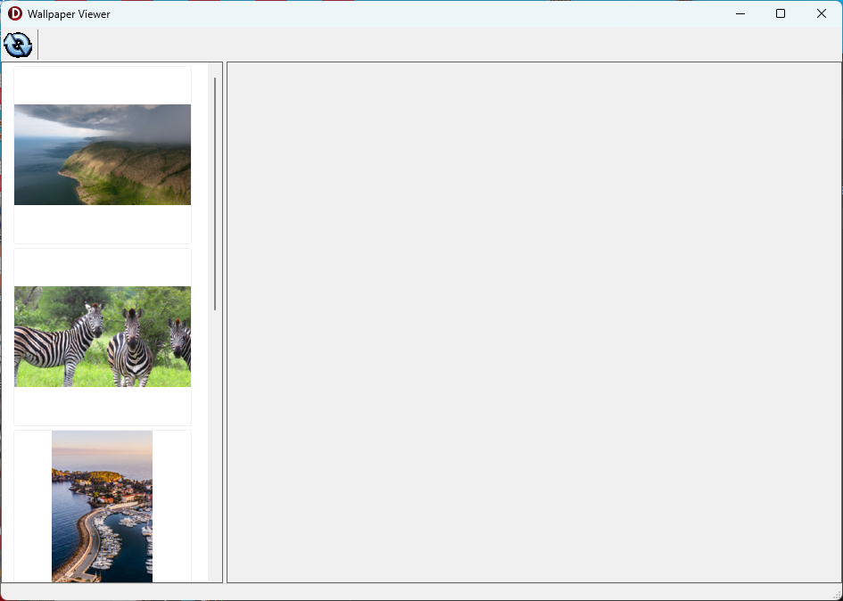

# WallpaperViewer
## 월페이퍼 미리보기

윈도우 11의 월페이퍼는 아래 디렉토리에 들어있음
```
C:\Users\[사용자 이름]\AppData\Local\Packages\Microsoft.Windows.ContentDeliveryManager_cw5n1h2txyewy\LocalState\Assets
```

이 프로그램은 해당 폴더에 있는 모든 파일을 가져와 미리보기 기능 및 다른 이름으로 저장하는 기능을 제공함.


